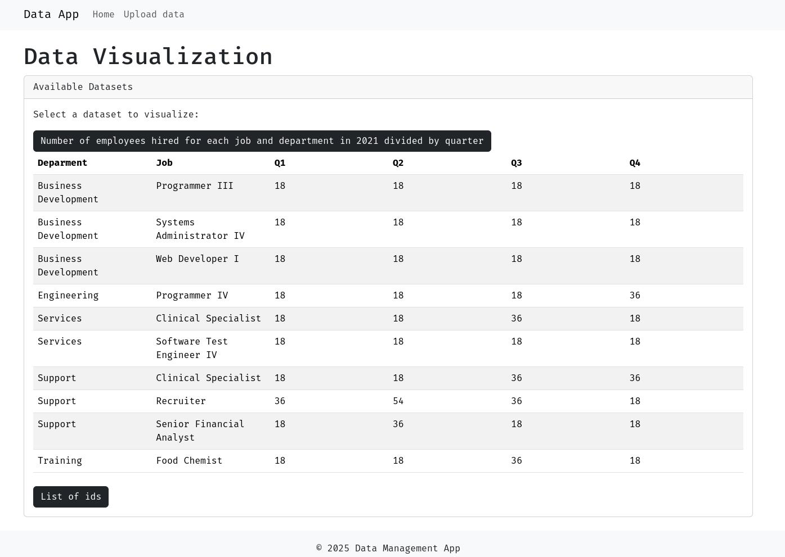

# Data Management App

This is a web application that allows users to upload data files and visualize the data in a user-friendly way.


## Features

- Upload data files
- Visualize data files

## Getting Started

### Prerequisites

- Python 3.12.x
- PostgreSQL

### Installation

1. Clone the repository:

```bash
git clone https://github.com/your-username/data-management-app.git
```

2. Install the required dependencies:

```bash
pip install -r requirements.txt
```

3. Create a PostgreSQL database and configure the `DB_URL` environment variable in the `.env` file.

4. Run the application:

```bash
# locally
uvicorn src.api:app --reload
```

```bash
# dockerized
docker build -t data-management-app .
docker run -p 8080:8080 -e DB_URL=postgresql://<username>:<password>@<host>:<port>/<database> data-management-app
```

## Usage

### Uploading Data Files

To upload data files, you can use the following API endpoints:

- `POST /api/v1/uploadfile/{file_type}`: Upload a file of the specified type.

The `file_type` parameter can be one of the following:

- `departments`
- `jobs`
- `hired_employees`

For example, to upload a `departments` file, you can use the following command:

```bash
curl -X POST \
  http://localhost:8080/api/v1/uploadfile/departments \
  -F "file=@path/to/file.csv"
```

### Visualizing Data Files

To visualize data files, you can use the following API endpoints:

- `GET /api/v1/getquarteremployees/{year}`: Get the number of employees hired for each job and department in the specified year.

The `year` parameter should be a four-digit year.

For example, to get the number of employees hired for each job and department in the year 2021, you can use the following command:

```bash
curl -X GET \
  http://localhost:8080/api/v1/getquarteremployees/2021
```

Or just visiting the index url you will be able to run the app with a ui.

Go to this link to get a preview [datamanagement.josebasblack.dev](https://datamanagement.josebasblack.dev/)

## Screenshots




## Contributing

Contributions are welcome! Please follow these steps:


1. Fork the repository.
2. Create a new branch for your changes.
